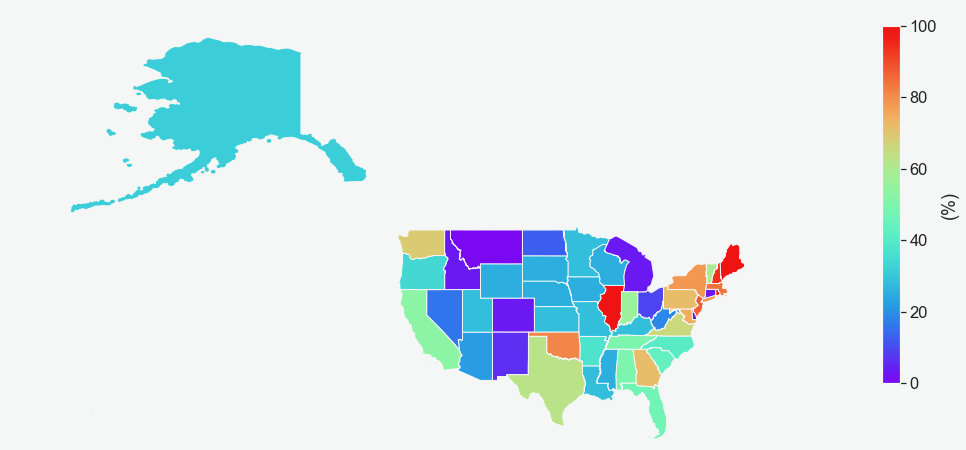
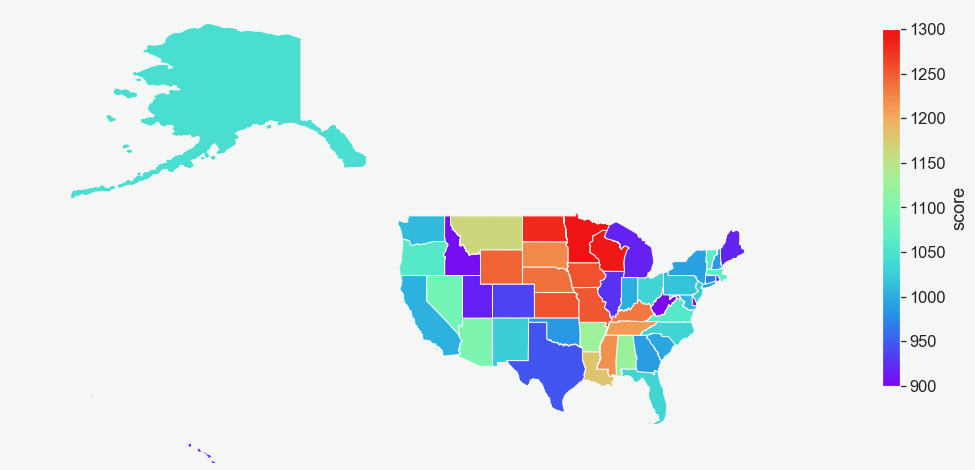
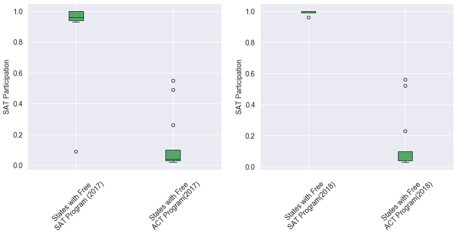
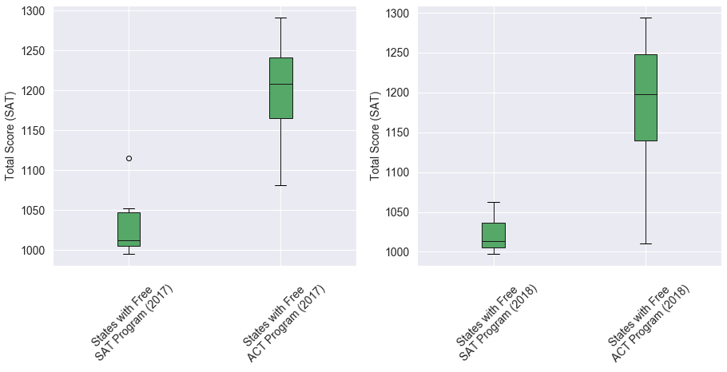

# A Comprehensive Analysis of  SAT Performance by State From 2017 to 2018

### Problem Statement

SAT and ACT are two of the main standardized tests for high schoolers in the United States. Admission to colleges is mostly dependent on the student’s performance in one of these tests. Although most states accept both exams, there are states that exclusively prefer one over the other. This analysis investigates the correlation between SAT participation by state against its total score and the lessons learned from it. This study reviews the SAT data for all 50 states, including District of Columbia, for a period of two years from 2017 to 2018 and highlights the states that the SAT is more popular and why. The findings of this study can help the state college boards, public and private schools, and the students and their families have a better strategy for the SAT exam.

### Contents:
- [Background](#Background)
- [Datasets](#Datasets)
- [Outside Research](#Outside-Research)
- [Data Dictionary](#Data-Dictionary)
- [Conclusions and Recommendations](#Conclusions-and-Recommendations)
- [References](#References)

### Background

The SAT and ACT are standardized tests that many colleges and universities in the United States require for their admissions process. This score is used along with other materials such as grade point average (GPA) and essay responses to determine whether a potential student will be accepted to the university.

The SAT has two sections of the test: Evidence-Based Reading and Writing and Math ([*source*](https://www.princetonreview.com/college/sat-sections)). The ACT has 4 sections: English, Mathematics, Reading, and Science, with an additional optional writing section ([*source*](https://www.act.org/content/act/en/products-and-services/the-act/scores/understanding-your-scores.html)). They have different score ranges, which you can read more about on their websites or additional outside sources (a quick Google search will help you understand the scores for each test):
* [SAT](https://collegereadiness.collegeboard.org/sat)
* [ACT](https://www.act.org/content/act/en.html)

Standardized tests have long been a controversial topic for students, administrators, and legislators. Since the 1940's, an increasing number of colleges have been using scores from students' performances on tests like the SAT and the ACT as a measure for college readiness and aptitude ([*source*](https://www.minotdailynews.com/news/local-news/2017/04/a-brief-history-of-the-sat-and-act/)). Supporters of these tests argue that these scores can be used as an objective measure to determine college admittance. Opponents of these tests claim that these tests are not accurate measures of students’ potential or ability and serve as an inequitable barrier to entry. Lately, more and more schools are opting to drop the SAT/ACT requirement for their Fall 2021 applications ([*read more about this here*](https://www.cnn.com/2020/04/14/us/coronavirus-colleges-sat-act-test-trnd/index.html)).

Prior to 2015, SAT was not a popular exam between students and teachers, mostly because of its level of difficulty and the tricky questions that were rarely covered in most of the high schools. Also, students would lose a point for every four question they answered incorrectly. This would lead to anxiety about deciding which questions to answer and which questions to skip. For all these reasons, teachers were not encouraging their students to take the SAT exam, since they felt the exam was not based on a typical public high-school curriculum. Moreover, they felt that the blame for students' poor performance would be pointed at them by parents or school districts ([*read more about this here*](https://www.nytimes.com/2014/03/09/magazine/the-story-behind-the-sat-overhaul.html)). 

To address all these concerns, the college board, the organization that administers the SAT, overhauled the SAT in 2015-2016 school year to make it more competitive and appealing against the ACT or other state-administered standardized tests. The college board also worked with different states to offer a program called SAT School Day. The program was designed to make expensive test-prep materials, review lessons and practice tests more accessible to all students. At the same time, some states started programs to cover the exam cost to help students from lower-income families to take the exam and increase participation.

All these efforts by the college board, state officials, school districts, and teachers have made the SAT more competitive, more useful, and fair to all students in the United States.

###  Datasets

There are 10 datasets included in the [`data`](./data/) folder. However, this project only uses the below datasets from [`data`](./data/) and [`Extra_data`](./data/) folders to complete its analysis.

* [`sat_2017.csv`](./data/sat_2017.csv): 2017 SAT Scores by State
* [`sat_2018.csv`](./data/sat_2018.csv): 2018 SAT Scores by State
* [`GDP_per_Capita_States.xlsx`](./Extra_data/GDP_per_Capita_States.xlsx): GDP per Capita by State from 2011 to 2018
* [`United_States-_States_Polygon.shp`](./Extra_data/Igismap/United_States-_States_Polygon.shp): US Map

### Outside Research

All states requiring a mandatory SAT exam cover its $52 cost. The only exception is West Virginia where the state requires its 11th graders to take a mandatory exam, but does not cover its cost. 
Below is the list of states that offer the SAT or ACT free to their high schoolers [(read more about this here)](https://blog.collegevine.com/states-that-require-sat/). 

|State               |Require SAT      |Require ACT    |Offer Free SAT|Offer Free ACT|
|:---:               |:---:    |:---:  |:---:   |:---:   |
|Alabama             |         |&#9745;|        | &#9745;|        
|Alaska              |         |       |        |        |        
|Arizona             |         |       |        |        |  
|Arkansas            |         |&#9745;|        | &#9745;|
|California          |         |       |        |        |  
|Colorado            |&#9745;  |&#9745;|&#9745; | &#9745;| 
|Connecticut         |&#9745;  |       |&#9745; |        | 
|Delaware            |&#9745;  |       |&#9745; |        | 
|District of Columbia|         |       |&#9745; |        |   
|Florida             |         |       |        |        |  
|Georgia             |         |       |        |        |  
|Hawaii              |         |&#9745;|        | &#9745;| 
|Idaho               |&#9745;  |       | &#9745;|        | 
|Illinois            |&#9745;  |       | &#9745;|        | 
|Indiana             |         |       |        |        |  
|Iowa                |         |       |        |        |  
|Kansas              |         |       |        |        |  
|Kentucky            |         |&#9745;|        | &#9745;|  
|Louisiana           |         |&#9745;|        | &#9745;| 
|Maine               |&#9745;  |       | &#9745;|        | 
|Maryland            |         |       |        |        |  
|Massachusetts       |         |       |        |        |  
|Michigan            |&#9745;  |       | &#9745;|        |    
|Minnesota           |         |       |        | &#9745;|    
|Mississippi         |         |       |        | &#9745;|   
|Missouri            |         |       |        | &#9745;|   
|Montana             |         |       |        |        |  
|Nebraska            |         |       |        | &#9745;|   
|Nevada              |         |       |        | &#9745;|  
|New Hampshire       |&#9745;  |       | &#9745;|        |
|New Jersey          |         |       |        |        |   
|New Mexico          |         |       |        |        |  
|New York            |         |       |&#9745; |        | 
|North Carolina      |         |&#9745;|        | &#9745;| 
|North Dakota        |         |       |        | &#9745;|  
|Ohio                |         |       |        |        |   
|Oklahoma            |         |       |&#9745; | &#9745;| 
|Oregon              |         |       |        |        |
|Pennsylvania        |         |       |        |        | 
|Rhode Island        |         |       |&#9745; |        |   
|South Carolina      |         |       |&#9745; | &#9745;| 
|South Dakota        |         |       |        |        |  
|Tennessee           |         |       |&#9745; |        | 
|Texas               |         |       |        |        |
|Utah                |         |       |        | &#9745;|  
|Vermont             |         |       |        |        |
|Virginia            |         |       |        |        |
|Washington          |         |       |        |        |
|West Virginia       |&#9745;  |       |        |        |   
|Wisconsin           |         |       |        | &#9745;|  
|Wyoming             |         |&#9745;|        | &#9745;| 
 
For more information, please check the following websites:
- [List of States that Require the SAT](https://blog.collegevine.com/states-that-require-sat/)
- [List of States that Require the ACT](https://blog.collegevine.com/states-that-require-the-act/)
- [States That Provide A Free ACT/ SAT Test](https://www.collegeraptor.com/getting-in/articles/act-sat/states-act-sat-given-free/)
- [List of U.S. states and territories by GDP per capita](https://en.wikipedia.org/wiki/List_of_U.S._states_and_territories_by_GDP_per_capita)

### Data Dictionary

Before starting any expletory analysis, below shows the data frame structure in this study.

|Feature|Type|Dataset|Description|
|:---:|:---:|:---:|:---|
|state|object|SAT|This represents the state where the test was taken. DC is also included in the dataset, although DC is not a state yet!| 
|participation|float|SAT|This shows the normalized participation. It ranges from 0 to 1. 0 indicates nobody took the exam and 1 indicates full participation of qualified candidates. | 
|reading_and_writing|int|SAT|This sums up the scores of reading and writing sections.| 
|math|int|SAT|This indicates the math score.| 
|total|int|SAT|This indicates the total exam score, which is the sum of math, reading and writing scores.| 
|year|object|SAT|This shows which year the exam is taken.| 
|gdp_per_capita|int|SAT|This highlights the GDP per Capita of the state the exam was taken in the given year.| 

### Conclusions and Recommendations

 
 
SAT is a standardized test widely used for college admissions in the United States. The test consists of reading, writing, and math categories with a total score range of 400-1600. This analysis investigates the SAT exam data by state for a period of two years, from 2016-2017 to 2017-2018, to answer the question: Do states with an SAT requirement report lower than average scores than states that encourage the ACT?   The SAT and ACT are standardized tests, yet they are different. For example, students cannot use a calculator while taking the SAT where they can in the ACT. As a result, students who are better in abstract math and mental calculations are more comfortable taking the SAT over the ACT. The time required to finish the SAT is slightly longer than the ACT, so students who prefer having more time during the exam are usually more interested in taking the SAT.  Published data indicates that the SAT is more popular in the east and west coasts, where there are more private schools and the ACT is more popular in the Midwest, where there are more publics schools. Students who do take the SAT in the Midwest, where participation is historically very low, score substantially higher than the national average score. For example, the state of Minnesota (where their average scores for 2017 and 2018 are 1298 and 1295, 172 and 175 points above the national average) sees one of lowest SAT participation in the nation. These high scores and low participation numbers indicate that only students who are well prepared take the SAT in Minnesota.   Connecticut, Delaware, Idaho, Illinois, Maine, Michigan, New Hampshire, and West Virginia are the states where the SAT is preferred for high school graduation. Participations in these states are close to 100%, except in West Virginia. If the participations for some of these states are not exactly 100%, it can be related to either inaccurate count of seniors in those states, or not having a state mandate to take the exam for the full school year. The most significant outlier between these states is West Virginia where the state prefers the SAT, but participation was 14% and 28% in 2017 and 2018, respectively. This state also reports lower than average scores in both years by 40 and 121 points, respectively. West Virginia has lower number of schools, school districts and students than most other states in nation. In West Virginia, the number of students who attend rural schools are significantly higher than students who attend suburban schools. In 2012-2013, 65.5% of students in West Virginia attended rural schools or town schools. In addition, the number of teacher vacancies in West Virginia more than doubled between 2013 and 2017. These can be some of the contributing factors why participation in West Virginia is lower than other states that prefer the SAT.   Another interesting observation can be found in Illinois. Illinois saw student participation jump 90% from 2016-2017 to 2017-2018. This substantial change is the result of a key decision made by the Illinois College Board in 2016-2017 school year. The college board made the SAT exam mandatory for all Illinois high schoolers, leading to the substantial jump in participation.   Florida saw the highest increase in total scores from 2017 to 2018 by 82 points. Students in Florida scored better in both math and reading/writing, but the state average score was lower than the national average. The increase in scores can be related to the free SAT school day events, where students have the opportunity to take the exam for free during school hours. The state collaboration with Khan Academy to provide free, online SAT review lessons and practice tests is also a key factor for this increase.   The SAT data by state show that participation has a strong negative correlation with total score. The states that require SAT see significantly higher participation, but these states report scores lower than national average.   The map of participation by state shows that this exam is more popular in east and west coasts than Midwest. A less accepted and mostly rejected argument between students and their families is that elite colleges in east and west coasts prefer SAT over the ACT; however, there is not enough data in this study to support this argument. A more accepted argument is that those states either require SAT for graduation or offer free SAT prep materials or review lessons to their students. These incentives could include covering the exam cost, free SAT school day events, or collaboration with online educational platforms like Khan Academy to provide free, online SAT review lessons and practice tests.   In conclusion, state participation in the SAT exam is a strong function of the state college board decisions to ask for the SAT or the ACT. Data shows that states where the college board require the SAT exam see higher participation but lower average scores. Most of these states cover the exam fee and offer school day programs to their high schoolers, so the students don't need to take the exam on weekends. However, these states do not have high average total scores in nation, since all the students in the states regardless of their level of preparedness need to take the exam for high school graduation. The students from states with low participation usually score substantially higher than the national average. These students are usually more prepared than the average students in their state or other states. So, the average total scores in these states are substantially higher. A general recommendation to improve average scores by state is to offer free SAT school day events, cover exam costs, and collaborate with online educational platforms like Khan Academy or Coursera to provide free, online SAT review lessons and practice tests.

<table><tr>
<td bgcolor="ghostwhite"> 
    <figure>
        

 
        
<figcaption>Figure 1a. SAT participation in 2018 by state</figcaption>

    </figure>
</td>    
<td bgcolor="ghostwhite">
    <figure>
        

        
<figcaption>Figure 1b. SAT total score in 2018 by state</figcaption>

    </figure> 
</td>    
</tr></table>  

<table><tr>
<td bgcolor="ghostwhite"> 
    <figure>
        

 
        
<figcaption>Figure 2a. SAT participation in the states provide free SAT programs against the states that offer free ACT programs</figcaption>

    </figure>
</td>    
<td bgcolor="ghostwhite">
    <figure>
        

         
<figcaption>Figure 2b. SAT scores in the states provide free SAT programs against the states that offer free ACT programs</figcaption>

    </figure> 
</td>    
</tr></table>   

### References

For more information, please check the following websites:
- [List of States that Require the SAT](https://blog.collegevine.com/states-that-require-sat/)
- [List of States that Require the ACT](https://blog.collegevine.com/states-that-require-the-act/)
- [States That Provide A Free ACT/ SAT 
Test](https://www.collegeraptor.com/getting-in/articles/act-sat/states-act-sat-given-free/)
- [List of U.S. states and territories by GDP per capita](https://en.wikipedia.org/wiki/List_of_U.S._states_and_territories_by_GDP_per_capita)
- [Illinois Changed to the SAT in 2017: What You Need to Know](https://www.testive.com/illinois/)
- [SAT and ACT Scores for Admission to Four-Year Vermont Colleges](https://www.thoughtco.com/sat-scores-four-year-vermont-colleges-788768)
- [Public education in West Virginia](https://ballotpedia.org/Public_education_in_West_Virginia)
- [Schools in poor, rural districts are the hardest hit by nation's growing teacher shortage](https://www.apmreports.org/story/2017/08/28/rural-schools-teacher-shortage)
- [SAT, ACT: Florida students lag behind national averages](https://www.orlandosentinel.com/news/education/os-ne-act-sat-florida-scores-20181024-story.html)
- [The Story Behind the SAT Overhaul](https://www.nytimes.com/2014/03/09/magazine/the-story-behind-the-sat-overhaul.html)

